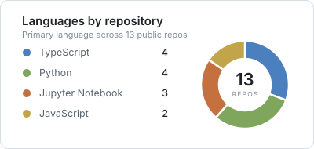
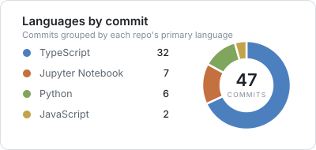

<picture>
  <source media="(prefers-color-scheme: dark)" srcset="./assets/header-dark.svg" />
  
</picture>

I build machine learning systems that end up in front of people the model, the service
around it, and the interface that makes it useful. Most of what's here started as a question
I wanted answered and turned into something that runs.

Currently working on predictive maintenance for military UAVs and ground vehicles.

### Selected work

**[uav-pdm-dashboard](https://github.com/mandalswarnim/uav-pdm-dashboard)**  
Predictive-maintenance digital twin for UAVs. LSTM, Transformer and CNN models in PyTorch,
trained on NASA C-MAPSS plus synthesized multirotor logs and served through FastAPI into a
Next.js dashboard.

**[ai-receptionist](https://github.com/mandalswarnim/ai-receptionist)**  
A phone receptionist that answers, understands and follows up — Twilio, GPT-4o and SendGrid.

**[Airfoil-Selector-for-Wind-Turbines](https://github.com/mandalswarnim/Airfoil-Selector-for-Wind-Turbines)**  
Ranks airfoils for small wind turbines by annual energy production under a site's real wind,
and explains why the winner wins.

**[mobile-decentralized-voting](https://github.com/mandalswarnim/mobile-decentralized-voting)**  
Decentralized voting on Ethereum — Solidity contracts behind an Express and React app.

**[Portfolio-NextJS-Vercel](https://github.com/mandalswarnim/Portfolio-NextJS-Vercel)**  
My portfolio site. [Live](https://portfolio-next-js-vercel-phi.vercel.app)

### Working with

Python · TypeScript · JavaScript · Solidity  
PyTorch · TensorFlow · Hugging Face · Jupyter  
Next.js · React · FastAPI · Django · Node  
Docker · Git · Vercel

### What I've been writing

  <picture>
    <source media="(prefers-color-scheme: dark)" srcset="./assets/languages-by-repo-dark.svg" />
    
  </picture>
  <picture>
    <source media="(prefers-color-scheme: dark)" srcset="./assets/languages-by-commit-dark.svg" />
    
  </picture>

<picture>
  <source media="(prefers-color-scheme: dark)" srcset="https://raw.githubusercontent.com/mandalswarnim/mandalswarnim/output/github-contribution-grid-snake-dark.svg" />
  
</picture>

### Elsewhere

[Portfolio](https://swarnimmandal.me/) · [LinkedIn](https://www.linkedin.com/in/swarnim-mandal-678976259/) · [Email](mailto:mswarnim1@gmail.com)

Off the clock: rock riffs, guitar strings, and building things that probably shouldn't work — but do.
