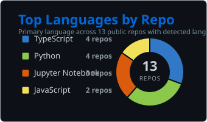

<h1 align="center">Hi, I'm Swarnim Mandal 👋</h1>

  

  

---

### 🧠 About Me

I build real-world AI systems ⚡  
From LLMs to full-stack apps, I turn ideas into working products.  
Always experimenting, always shipping.

🚀 **Currently working on:** Predictive maintainability of military UAV drones and vehicles.

---

### 🛠️ Tech Stack

#### 🧠 AI / ML

#### 🌐 Development

#### ⚙️ Tools

---

### 📊 GitHub Stats

  

  
  

  
  

  

  

---

### 🐍 Contribution Snake

  

---

### 🌐 Find Me Here

  
  
  

---

  <i>🎸 Off the clock: rock riffs, guitar strings, and building things that probably shouldn't work — but do.</i>

